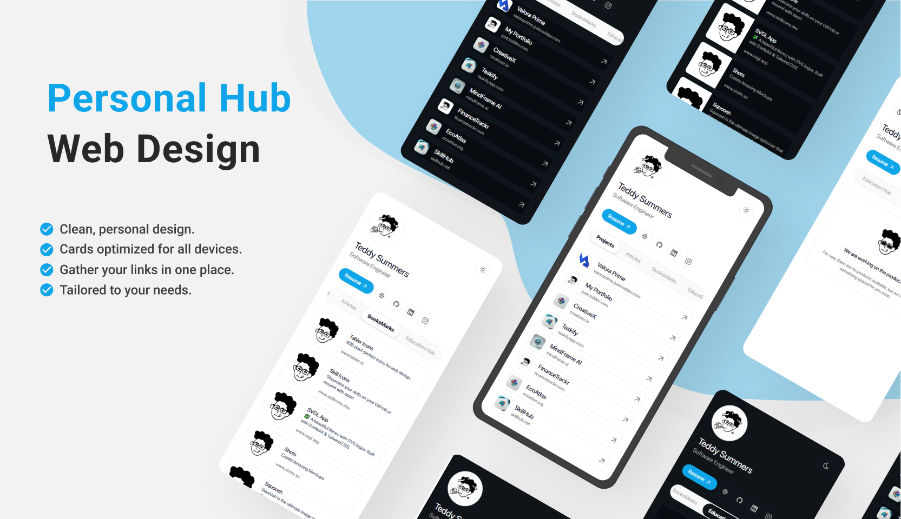
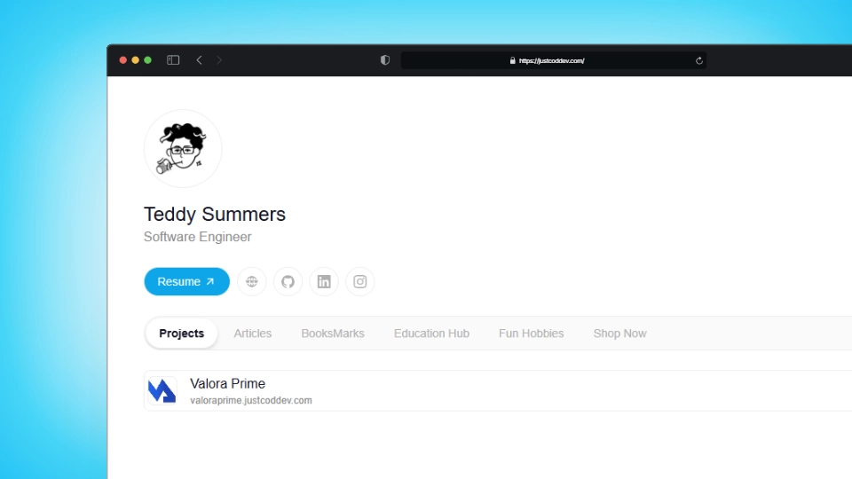
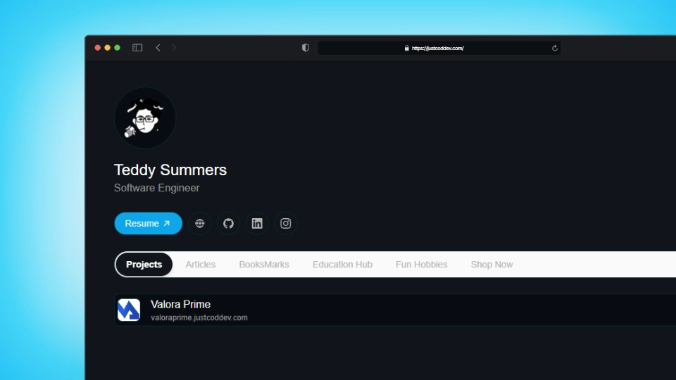
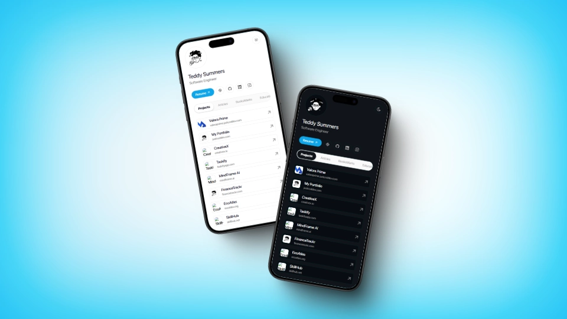
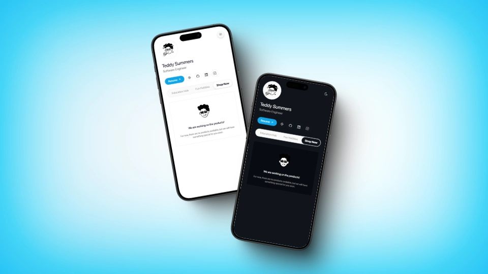

# Personal Hub


[](https://github.com/itsteddydev/hub-itsteddydev)

[](https://opensource.org/licenses/MIT)



## Description

Personal Hub is a template designed to centralize and organize personal or professional information in one place. This tool allows users to manage and access their data, projects, important links, and more, all from a unified interface.

## Table of Contents

- [Features](#features)
- [Technologies Used](#technologies-used)
- [Installation](#installation)
- [Usage](#usage)
- [Screenshots](#screenshots)
- [License](#license)
- [Contact](#contact)

## Features

- **Centralized Management**: Access all your information from a single place.
- **Customization**: Configure and adapt the interface to your needs.
- **Integrations**: Connect with various platforms and external services.
- **Security**: Protect your data with proper authentication and authorization.

## Technologies Used

- **Astro**: Main framework for building the interface.
- **Tailwind CSS**: Styling and responsive design.
- **Vercel**: Deployment and hosting of the application.

## Installation

Follow these steps to install and run the project locally:

1. **Clone the repository**:

   ```bash
   git clone https://github.com/itsteddydev/hub-itsteddydev.git
   ```

2. **Navigate to the project directory**:

   ```bash
   cd hub-itsteddydev
   ```

3. **Install dependencies**:

   ```bash
   npm install
   ```

4. **Start the development server**:

   ```bash
   npm run dev
   ```

5. Open your browser and visit `http://localhost:4321` to see the application in action.


## Usage

Once the application is running, you can:

- **Customize your profile**: Add, edit, or remove personal information.
- **Add links**: Include links to your projects, social media, or any relevant resources.
- **Configure widgets**: Enable or disable modules according to your preferences.

## Screenshots










## License

This project is licensed under the MIT License. See the [LICENSE](./LICENSE) file for more details.

## Contact

For inquiries, suggestions, or feedback, you can reach me through:


- **LinkedIn**: [itsteddydev](https://www.linkedin.com/in/itsteddydev/)
- **Twitter**: [@itsteddydev](https://twitter.com/itsteddydev)

---

Thank you for using Personal Hub! We hope this tool helps you efficiently organize and centralize your information.
